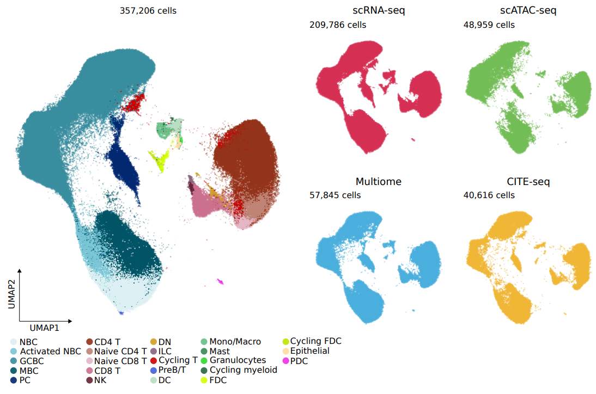

# An Atlas of Cells in the Human Tonsil 

Palatine tonsils are secondary lymphoid organs (SLOs) representing the first line of immunological defense
against inhaled or ingested pathogens. We generated an atlas of the human tonsil composed of >556,000 cells
profiled across five different data modalities, including single-cell transcriptome, epigenome, proteome, and
immune repertoire sequencing, as well as spatial transcriptomics. This census identified 121 cell types and states,
defined developmental trajectories, and enabled an understanding of the functional units of the tonsil. Exemplarily,
we stratified myeloid slan-like subtypes, established a BCL6 enhancer as locally active in follicle-associated T
and B cells, and identified SIX5 as putative transcriptional regulator of plasma cell maturation. Analyses of a
validation cohort confirmed the presence, annotation, and markers of tonsillar cell types and provided evidence
of age-related compositional shifts. We demonstrate the value of this resource by annotating cells from B cell-derived
mantle cell lymphomas, linking transcriptional heterogeneity to normal B cell differentiation states of the human tonsil.

This repository contains all the scripts, notebooks and reports to reproduce all analysis from our manuscript
entitled [_An Atlas of Cells in the Human Tonsil_](https://www.cell.com/immunity/fulltext/S1074-7613(24)00031-1), published in Immunity in 2024.
Here, we describe how to access the data, document the most important packages and versions used, and explain how
to navigate the directories and files in this repository.




## Data

The data has been deposited in five levels of organization, from raw to processed data:


* Level 1: raw data. All fastq files for all data modalities have been deposited at ArrayExpress under accession id [E-MTAB-13687](https://www.ebi.ac.uk/biostudies/arrayexpress/studies/E-MTAB-13687).
* Level 2: matrices. All data modalities correspond to different technologies from 10X Genomics. As such, they were mapped with different flavors of CellRanger (CR). The most important files in the ‘‘outs’’ folder of every CR run (including all matrices) have been deposited in [Zenodo](https://zenodo.org/records/10373041).
* Level 3: Seurat Objects. All data was analyzed within the Seurat ecosystem. We have archived in [Zenodo](https://zenodo.org/records/8373756) all Seurat Objects that contain the raw and processed counts, dimensionality reductions (PCA, Harmony, UMAP), and metadata needed to reproduce all figures from this manuscript.
* Level 4: to allow for programmatic and modular access to the whole tonsil atlas dataset, we developed [HCATonsilData](https://bioconductor.org/packages/release/data/experiment/html/HCATonsilData.html), available on BioConductor. HCATonsilData provides a vignette which documents how to navigate and understand the data. It also provides access to the glossary to traceback all annotations in the atlas. In addition, we will periodically update the annotations as we refine it with suggestions from the community.
* Level 5: interactive mode. Our tonsil atlas has been included as a reference in [Azimuth](https://azimuth.hubmapconsortium.org/references/#Human%20-%20Tonsil%20v2), which allows interactive exploration of cell type markers on the web.

We refer to the READMEs in the Zenodo repositories for an explanation of how to access the matrices and Seurat objects. Users can follow these steps to download the fastq files:

1. Download a tsv file that lists all the fastq files available in the repository and filter them to the modality of choice. We will exemplify it here with scRNA-seq. Note: the URL was copied from the section "Download report" from secondary section id [ERP156759](https://www.ebi.ac.uk/ena/browser/view/PRJEB71973) of ArrayExpress.

```{bash}
PATH_TSV="https://www.ebi.ac.uk/ena/portal/api/filereport?accession=PRJEB71973&result=read_run&fields=study_accession,sample_accession,experiment_accession,run_accession,tax_id,scientific_name,fastq_ftp,submitted_ftp,sra_ftp,bam_ftp&format=tsv&download=true&limit=0"
wget -O fastq_list_tonsil_atlas.tsv "$PATH_TSV"
grep "scRNA-seq" fastq_list_tonsil_atlas.tsv > fastq_list_tonsil_atlas_scRNA.tsv
```

2. Create metadata using the names of the fastq files. Inspired by [The Cancer Genome Atlas (TCGA)](https://docs.gdc.cancer.gov/Encyclopedia/pages/TCGA_Barcode/), we have encoded all the metadata for a single fastq file in the name itself:

[TECHNOLOGY].[DONOR_ID].[SUBPROJECT].[GEM_ID].[LIBRARY_ID].[LIBRARY_TYPE].[PAIR_ID].[READ].fastq.gz

Here's a more detailed description of each field:

* TECHNOLOGY: scRNA-seq, scATAC-seq, Multiome, CITE-seq+scVDJ-seq, and spatial transcriptomics (Visium). We also include the fastq files associated with the multiome experiments performed on two mantle cell lymphoma patients (MCL).
* DONOR_ID: identifier for each of the 17 patients included in the cohort. We provide the donor-level metadata in the file "tonsil_atlas_donor_metadata.csv", including the hospital, sex, age, age group, cause for tonsillectomy and cohort type for every donor.
* SUBPROJECT: each subproject corresponds to one run of the 10x Genomics Chromium™ Chip.
* GEM_ID: each run of the 10x Genomics Chromium™ Chip consists of up to 8 "GEM wells" (see [10X documentation](https://www.10xgenomics.com/support/software/cell-ranger/getting-started/cr-glossary)): a set of partitioned cells (Gel Beads-in-emulsion) from a single 10x Genomics Chromium™ Chip channel. We give a unique identifier to each of these channels.
* LIBRARY_ID: one or more sequencing libraries can be derived from a GEM well. For instance, multiome yields two libraries (ATAC and RNA) and CITE-seq+scVDJ yields 4 libraries (RNA, ADT, BCR, TCR).
* LIBRARY_TYPE: the type of library for each library_id. Note that we used cell hashing () for a subset of the scRNA-seq libraries, and thus the library_type can be "not_hashed", "hashed_cdna" (RNA expression) or "hashed_hto" (the hashtag oligonucleotides).
* PAIR_ID: to increase sequencing depth, each library was sequenced in more than one lane. This id identifies the pairs of fastq files (R1, R2) for a given subproject. It is used in the scripts below to assign the lane (e.g. L001).
* READ: for scATAC-seq we have three reads (R1, R2 or R3), see cellranger-atac's documentation. While we find these names to be the most useful, they need to be changed to follow cellranger's conventions.


```{bash}
cut -f8 fastq_list_tonsil_atlas_scRNA.tsv | cut -d'/' -f6 | cut -d';' -f1 > fastq_names_scRNA.txt
echo "technology,donor_id,subproject,gem_id,library_id,library_type,lane,read" > tonsil_atlas_fastq_metadata.csv
sed 's/\.fastq\.gz//g' fastq_names_scRNA.txt | sed 's/\./,/g' >> tonsil_atlas_fastq_metadata.csv
```

Each line of "fastq_list_tonsil_atlas_scRNA.tsv" contains both read 1 (R1) and read 2 (R2). With the code above we are subsetting R1.

*IMPORTANT NOTE*: all fastq files derived from a single GEM well need to be mapped together because they correspond to the same set of cells and hence are given the same set of cell barcodes.

We will exemplify the following steps with both kind of libraries (hashed and not_hashed), whichg will ensure that we understand the intricacies of both types. We will focus on two GEM_IDs (one of each type), but users should be able to parallelize the same procedure across all gem_ids using different jobs in a high performance computer (HPC, aka cluster).


3. Download cellranger. As of 4/2/2024, the most recent version is [v7.2.0](https://www.10xgenomics.com/support/software/cell-ranger/downloads):

```{bash}
# Download cellranger 7.2.0
curl -o cellranger-7.2.0.tar.gz "https://cf.10xgenomics.com/releases/cell-exp/cellranger-7.2.0.tar.gz?Expires=1707140304&Key-Pair-Id=APKAI7S6A5RYOXBWRPDA&Signature=PGlaWX3hp28M3LlIwTrq880Rl3WjOwpBS-qNynL5zz-z6iLl-8ZpO~oK038dsvTk920KKIPMGzvBcqp~LUddLYQav82XBEgGc20QZUlvtv5t0bYr-eBSzHQCv20U95528H4feUABmE~rzuG~uvlz6-04D-iqmab5kset7kLwkmtY3ijnbRmRGXmCtfwWg~fQIJS8tGDJGS9JfVsTz2gsxaHL5J8GW4UQ8XqdszB4Dv~14c9uByThoIJCsU~CC7YFPtg~UoACnRzuT6DzyJzF0vvwRQ3pX0z6aLbHUkPnlQej3D9oiH~ZxXQjL3lTxaRaberv9rShjDY89Ta6YtPt4A__"
tar -xzf cellranger-7.2.0.tar.gz


# Download human reference
curl -O "https://cf.10xgenomics.com/supp/cell-exp/refdata-gex-GRCh38-2020-A.tar.gz"
tar -xzf refdata-gex-GRCh38-2020-A.tar.gz
```


## Not hashed

3.1. Download fastqs for gem_id y7qn780g_p6jkgk63:

```{bash}
gem_id="y7qn780g_p6jkgk63"
fastqs_urls=$(grep $gem_id fastq_list_tonsil_atlas_scRNA.tsv | cut -f8)
mkdir -p $gem_id/fastqs
for url in $fastqs_urls;
do
    url_fastq1=$(echo $url | cut -d';' -f1)
    echo $url_fastq1
    wget -P $gem_id/fastqs $url_fastq1
    url_fastq2=$(echo $url | cut -d';' -f2)
    echo $url_fastq2
    wget -P $gem_id/fastqs $url_fastq2
done
```

3.2. Rename fastq files following [cellranger conventions](https://www.10xgenomics.com/support/software/cell-ranger/latest/analysis/inputs/cr-specifying-fastqs).

```{bash}
# Create an associative array to hold the mapping from pair_id to lane_id
declare -A lane_dict
counter=1
pair_ids=$(ls $gem_id/fastqs | cut -d'.' -f7 | sort | uniq)
for pair_id in $pair_ids; do
    echo $pair_id
    lane_dict[$pair_id]=$counter
    ((counter++))
done


# Change fastq names to cellranger-friendly
for fastq in $(ls $gem_id/fastqs); do
    read=$(echo $fastq | cut -d'.' -f8)
    pair_id=$(echo $fastq | cut -d'.' -f7)
    lane=${lane_dict[$pair_id]}
    new_name="${gem_id}_S1_L00${lane}_${read}_001.fastq.gz"
    echo "Creating symbolic link for $fastq as $new_name"
    ln -s "$fastq" "$gem_id/fastqs/$new_name"
done
```

3.3. Run [cellranger count](https://www.10xgenomics.com/support/software/cell-ranger/latest/tutorials/cr-tutorial-ct):

```{bash}
cellranger-7.2.0/cellranger count --id="run_count_${gem_id}" \
   --fastqs=$gem_id/fastqs \
   --sample=$gem_id \
   --transcriptome=refdata-gex-GRCh38-2020-A
```

## Package versions

* [Seurat 3.2.0 and 4.1.0](https://satijalab.org/seurat/)
* [Signac 1.1.0](https://github.com/timoast/signac)
* [harmony 1.0](https://github.com/immunogenomics/harmony)
* [lisi 1.0](https://github.com/immunogenomics/LISI)
* [scrublet 0.2.1](https://github.com/swolock/scrublet)
* [UCell 1.99.7](https://github.com/carmonalab/UCell)
* [clusterProfiler 4.3.4](https://yulab-smu.top/biomedical-knowledge-mining-book/)
* [pySCENIC 0.10.3](https://scenic.aertslab.org/)
* [CellPhoneDB 3](https://www.cellphonedb.org/)
* [chromVar 1.1.0](https://bioconductor.org/packages/release/bioc/html/chromVAR.html)
* [JASPAR2020 0.99.10](http://bioconductor.org/packages/release/data/annotation/html/JASPAR2020.html)
* [chromVARmotifs 0.2.0](https://github.com/GreenleafLab/chromVARmotifs)
* [Vireo 0.5.0](https://github.com/single-cell-genetics/vireo)
* [Scirpy 0.7.0](https://scverse.org/scirpy/latest/tutorials.html)
* [SPOTlight 0.1.7](https://bioconductor.org/packages/release/bioc/html/SPOTlight.html)
* [Rmagic 2.0.3](https://github.com/KrishnaswamyLab/MAGIC)
* [SPATA2 0.1.0](https://github.com/theMILOlab/SPATA2)

You can check the versions of other packages at the "Session Information" section of each html report. To visualize one of the html reports online, you can copy&paste the URL of the report directly into the [HTML GitHub viewer](https://htmlpreview.github.io/).


# File system and name scheme

Although each technology requires specific analysis, they also share a similar pre-processing pipeline.
We have strived to harmonize these pipelines into similar naming schemes so that it is easy for users
to navigate this repo. Likewise, we have tried to code in a shared style. These are the most important steps:

* 1-cellranger_mapping: scripts used to run cellranger in our cluster. It also contains QC metrics for different sequencing runs.
* 2-QC: quaity control for the sequencing and mapping of raw data, filtering of poor-quality cells and genes, normalization, doublet detection, and batch effect correction.
* 3-clustering: we followed a top-down clustering approach (see methods of our manuscript). Thus, the clustering is organized by levels, in which we move from general cellular compartments to granular cell types and states in a hierarchical and recursive fashion. In this notebooks we have also included the annotation, which was established in collaboration with the annotation team.
* 4-revision: we include one folder with the analysis performed to answer each of the major reviews during the revision of the manuscript.
Other more focused analysis include:

* [Gene regulatory inference using pySCENIC](https://github.com/Single-Cell-Genomics-Group-CNAG-CRG/TonsilAtlas/tree/main/scRNA-seq/gene_regulatory_networks/pyScenic)
* [Gene Set Enrichment analysis for different slancyte subsets](https://github.com/Single-Cell-Genomics-Group-CNAG-CRG/TonsilAtlas/blob/main/scRNA-seq/gsea/gsea_myeloid.Rmd)
* [Cell-cell interactions with cellPhoneDB](https://github.com/Single-Cell-Genomics-Group-CNAG-CRG/TonsilAtlas/tree/main/scRNA-seq/cell_to_cell_networks)
* [Label transfer from RNA to ATAC](https://github.com/Single-Cell-Genomics-Group-CNAG-CRG/TonsilAtlas/blob/main/scATAC-seq/3-Label_transfering/01-scATAC_annotation_KNN.Rmd)
* [Motif analysis with chromVAR](https://github.com/Single-Cell-Genomics-Group-CNAG-CRG/TonsilAtlas/tree/main/scATAC-seq/5-motif_analysis)
* [Clonotype analysis with scirpy](https://github.com/Single-Cell-Genomics-Group-CNAG-CRG/TonsilAtlas/blob/main/CITE-seq/08-sub_clustering/CD4_T/05-scirpy_tcr.ipynb)
* [Spot deconvolution with SPOTlight](https://github.com/Single-Cell-Genomics-Group-CNAG-CRG/TonsilAtlas/tree/main/spatial_transcriptomics/05-sc_map)


In addition, the ["figures_and_scripts"](https://github.com/Single-Cell-Genomics-Group-CNAG-CRG/TonsilAtlas/tree/main/scRNA-seq/figures_and_tables) folder contains the scripts used to generate most of the figures in the manuscript. Finally, the ["bin"](https://github.com/Single-Cell-Genomics-Group-CNAG-CRG/TonsilAtlas/tree/main/scRNA-seq/bin) folder contains functions and utilities used throughout many scripts.

# Getting the code

You can download a copy of all the files in this repository by cloning the git repository:

```{bash}
git clone https://github.com/Single-Cell-Genomics-Group-CNAG-CRG/TonsilAtlas.git
```

# Relevant literature

* [Single-cell analysis of human B cell maturation predicts how antibody class switching shapes selection dynamics](https://www.science.org/doi/10.1126/sciimmunol.abe6291?url_ver=Z39.88-2003&rfr_id=ori:rid:crossref.org&rfr_dat=cr_pub%20%200pubmed)
* [Dynamics of B cells in germinal centres](https://www.nature.com/articles/nri3804)
* [The generation of antibody-secreting plasma cells](https://www.nature.com/articles/nri3795)
* [Integrated single-cell transcriptomics and epigenomics reveals strong germinal center–associated etiology of autoimmune risk loci](https://www.science.org/doi/10.1126/sciimmunol.abh3768?url_ver=Z39.88-2003&rfr_id=ori:rid:crossref.org&rfr_dat=cr_pub%20%200pubmed)
* [Characterization of human FDCs reveals regulation of T cells and antigen presentation to B cells](https://rupress.org/jem/article/218/10/e20210790/212590/Characterization-of-human-FDCs-reveals-regulation)
* [Bcl6-Mediated Transcriptional Regulation of Follicular Helper T cells (TFH)](https://www.cell.com/trends/immunology/fulltext/S1471-4906(21)00026-0)
* [A distinct subpopulation of CD25− T-follicular regulatory cells localizes in the germinal centers](https://www.pnas.org/doi/abs/10.1073/pnas.1705551114)
* [T Follicular Helper Cell Biology: A Decade of Discovery and Diseases](https://www.cell.com/immunity/fulltext/S1074-7613(19)30191-8?_returnURL=https%3A%2F%2Flinkinghub.elsevier.com%2Fretrieve%2Fpii%2FS1074761319301918%3Fshowall%3Dtrue)
* [Innate Lymphoid Cells: 10 Years On](https://www.sciencedirect.com/science/article/pii/S0092867418309115)
* [Single-cell RNA-seq reveals new types of human blood dendritic cells, monocytes, and progenitors](https://www.science.org/doi/10.1126/science.aah4573?url_ver=Z39.88-2003&rfr_id=ori:rid:crossref.org&rfr_dat=cr_pub%20%200pubmed)
* [A cell atlas of human thymic development defines T cell repertoire formation](https://www.science.org/doi/10.1126/science.aay3224?url_ver=Z39.88-2003&rfr_id=ori:rid:crossref.org&rfr_dat=cr_pub%20%200pubmed)
* [Deciphering the fate of slan+-monocytes in human tonsils by gene expression profiling](https://faseb.onlinelibrary.wiley.com/doi/abs/10.1096/fj.202000181R)
* [FDC-SP, a Novel Secreted Protein Expressed by Follicular Dendritic Cells](https://www.jimmunol.org/content/169/5/2381.long)


